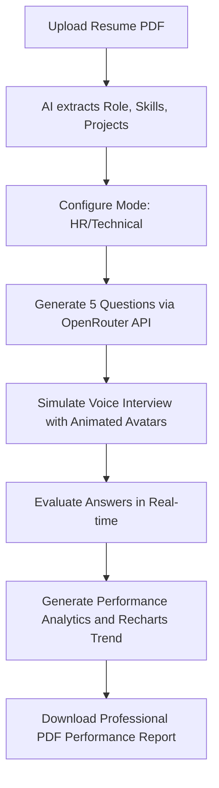

# 🧠 InterviewIQ - AI-Powered Mock Interview Platform

InterviewIQ is an interactive, full-stack web application designed to help candidates prepare for real-world job interviews. By leveraging advanced Large Language Models via the OpenRouter API and modern web technologies, the platform simulates realistic technical and HR interviews, evaluates user performance in real-time, and provides detailed analytics.

---

## 🚀 Key Features

*   **📄 AI-Powered Resume Analysis**: Upload your resume in PDF format. The backend extracts text using `pdfjs-dist` and sends it to the LLM to automatically parse your job role, experience level, projects, and skills.
*   **🗣️ Speech-Enabled Interactions**:
    *   **Text-to-Speech (TTS)**: The AI interviewer reads questions and evaluation feedback aloud in a natural human-like voice using the browser's native `SpeechSynthesis` API.
    *   **Speech-to-Text (STT)**: Dictate your answers hands-free using the browser's `SpeechRecognition` API (Web Speech API).
*   **🎭 Animated AI Avatars**: Features male and female video avatars that realistically animate (talking) while the AI is speaking and pause/reset when the speech ends.
*   **⏱️ Smart Timing & Difficulty Progression**: Supports adaptive interview sessions with 5 questions progressing from **Easy** (Q1, Q2) to **Medium** (Q3, Q4) to **Hard** (Q5). Each question has a custom countdown timer.
*   **📊 Comprehensive Performance Analytics**:
    *   Evaluates answers in real-time across three key dimensions: **Confidence**, **Communication**, and **Correctness** (rated from 0 to 10).
    *   Visualizes performance trends across the interview using interactive **Recharts Area Charts**.
*   **📄 Downloadable PDF Reports**: Instantly generate and download a professional, beautifully formatted PDF report containing score metrics, question-wise breakdown, and personalized professional advice using `jsPDF` and `jspdf-autotable`.
*   **💳 Credits & Razorpay Payment Integration**:
    *   Features a credit-based model where creating an interview costs **50 credits** (users start with 100 free credits).
    *   Integrated with the **Razorpay Payment Gateway** for purchasing Starter or Pro credit packs.

---

## 🛠️ Technology Stack

### Frontend (Client)
*   **Framework**: React 19 (Vite)
*   **Routing**: React Router 7
*   **State Management**: Redux Toolkit & React Redux
*   **Styling**: TailwindCSS v4 & React Icons
*   **Animations**: Framer Motion (`motion`)
*   **Data Visualization**: Recharts (for performance charts)
*   **Document Generation**: jsPDF & jspdf-autotable
*   **Voice Features**: Web Speech API (`SpeechSynthesis` & `webkitSpeechRecognition`)

### Backend (Server)
*   **Runtime**: Node.js & Express.js (v5)
*   **Database**: MongoDB (via Mongoose ODM)
*   **AI Integration**: OpenRouter API (`openai/gpt-3.5-turbo`)
*   **Payment Gateway**: Razorpay Node SDK
*   **File Handling**: Multer (for handling PDF resume uploads)
*   **Text Extraction**: PDF.js (via `pdfjs-dist`)

---

## 📁 Repository Structure

```text
InterviewIQ/
├── client/                 # React Frontend (Vite)
│   ├── public/             # Static public assets
│   ├── src/
│   │   ├── assets/         # Images, animated video avatars
│   │   ├── components/     # Reusable components (Navbar, Footer, Step1SetUp, Step2Interview, Step3Report)
│   │   ├── pages/          # Page views (Home, Auth, InterviewPage, InterviewHistory, Pricing, InterviewReport)
│   │   ├── redux/          # Redux slices (user slice)
│   │   ├── utils/          # Helper utilities
│   │   ├── App.jsx         # App router and bootstrap
│   │   └── main.jsx        # App entry point
│   ├── package.json
│   └── vite.config.js
│
└── server/                 # Express Backend
    ├── config/             # DB connections
    ├── controllers/        # Route controllers (Auth, Interview, Payment, User)
    ├── middlewares/        # Authentication & Upload middleware
    ├── models/             # Mongoose schemas (User, Interview, Payment)
    ├── routes/             # Express API endpoints
    ├── services/           # External API wrappers (OpenRouter, Razorpay)
    ├── index.js            # Express server entry point
    └── package.json
```

---

## ⚙️ Environment Configuration

To run the project locally, create a `.env` file in both the `client` and `server` folders using the keys below:

### Client Environment Variables (`client/.env`)
```env
VITE_FIREBASE_APIKEY=your_firebase_api_key
VITE_RAZORPAY_KEY_ID=your_razorpay_key_id
```

### Server Environment Variables (`server/.env`)
```env
PORT=8000
MONGODB_URL=your_mongodb_connection_uri
JWT_SECRET=your_jwt_secret_token
OPENROUTER_API_KEY=your_openrouter_api_key
RAZORPAY_KEY_ID=your_razorpay_key_id
RAZORPAY_KEY_SECRET=your_razorpay_key_secret
```

---

## 🚀 Getting Started

### Prerequisites
*   Node.js installed on your machine.
*   MongoDB instance (local or Atlas cluster).
*   Active accounts on OpenRouter and Razorpay (for API credentials).

### Setup and Installation

#### 1. Clone the repository
```bash
git clone https://github.com/amanverma420/AI-interview-temp.git
cd AI-interview-temp
```

#### 2. Start the Backend Server
```bash
cd server
npm install
npm run dev
```
The server will boot up and listen on port `8000` (or `PORT` specified in `.env`), connecting automatically to MongoDB.

#### 3. Start the Frontend client
```bash
cd ../client
npm install
npm run dev
```
The client app will launch locally on [http://localhost:5173](http://localhost:5173).

---

## 📝 How the AI Interview Process Works



1.  **Resume Upload & Setup**: The candidate uploads their resume. `pdfjs-dist` parses the raw text, which is parsed into a JSON schema (`role`, `skills`, `projects`, `experience`) via OpenRouter.
2.  **Question Generation**: The system builds a customized system prompt using candidate profile details. It calls OpenRouter API with a structured prompt instructing the model to act as a human interviewer and generate 5 targeted questions (progressing from easy to hard).
3.  **Conducting the Interview**: The browser reads out the questions. The candidate responds verbally or through typing. The application automatically starts voice-transcription.
4.  **Evaluation & Scoring**: Each response is graded on Communication, Correctness, and Confidence. The average forms the score (out of 10), and the candidate receives short constructive feedback read aloud.
5.  **Analytics and PDF generation**: At the end of the session, the database records the aggregated scores, and the UI presents an interactive performance dashboard with Recharts. Users can export this dashboard as a clean PDF.
